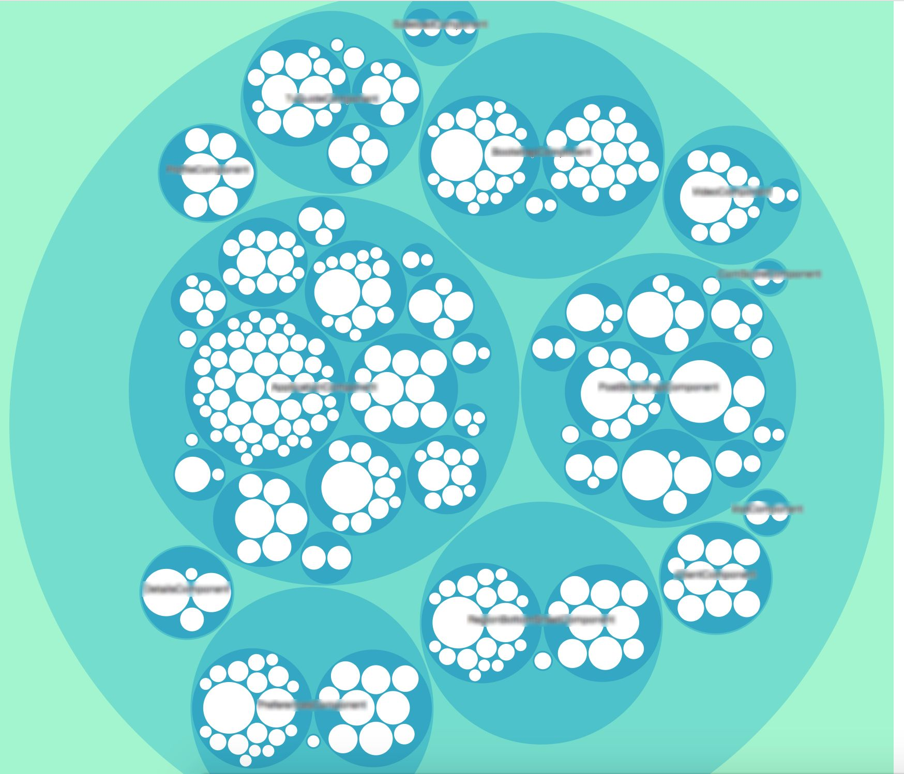
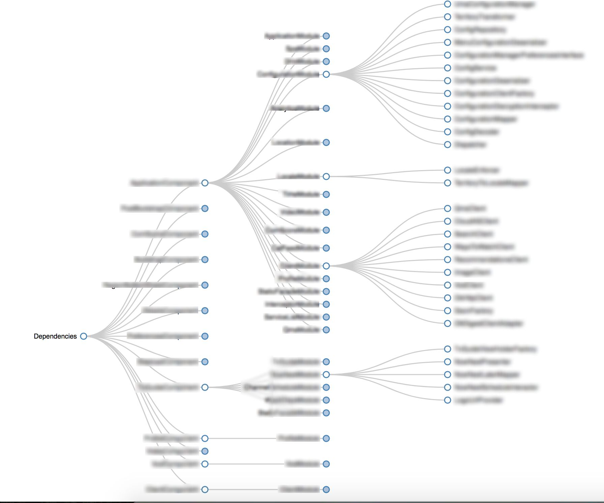
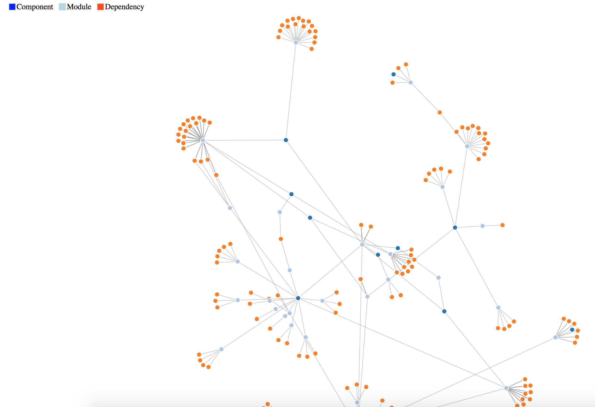

<p align="center"><a href="https://github.com/dvdciri/daggraph" target="_blank"></a></p>
<h1 align="center">Daggraph</h1>
<p align="center"><a href="http://square.github.io/dagger/" target="_blank">Dagger</a> dependency graph generator for Android Developers</p>
<p align="center">
  <a href="https://travis-ci.org/dvdciri/daggraph"></a>
  <a href="https://www.npmjs.com/package/daggraph"></a>
  <a href="https://www.npmjs.com/package/daggraph"></a>
  <a href="LICENSE"></a>
</p>

## Usage
Analyze the current folder:
> daggraph

or

Analyze a specific folder:
> daggraph `<folder_path>`

Select which chart you want to generate:

<p align="center">
  
  
  
</p>

## Features
Those are the features that are currently supported and used to build the graph, some of them are work in progress while some other will be picked up at a later stage

| Feature               | Java          | Kotlin  |
| ----------------------|:-------------:|:-------:|
| @Module               |  ✅           |   🚧     |
| @Component            |  ✅           |   🚧     |
| @SubComponent         |  ✅           |   🚧     |
| @Provides             |  ✅           |   🚧     |
| Field @Inject         |  ✅           |   🚧     |
| Constructor @Inject   |  ❌           |   ❌     |
| @Named()              |  ❌           |   ❌     |
| @Binds                |  ❌           |   ❌     |
| Component dependencies|  ❌           |   ❌     |
| Extended modules      |  ❌           |   ❌     |

## Install
```sh
npm install -g daggraph
```

## Contribute
Feel free to contribute by checking out the issues and picking somethig up! 😄 (follow the general opensource <a href="https://opensource.guide/how-to-contribute/">contribution giudelines</a>)

A big shout for the contributions:
- [Matteo Basso](https://github.com/mbasso)
- [César Ferreira](https://github.com/cesarferreira)

## Created by
[Davide Cirillo](https://github.com/dvdciri)

## License
MIT © [Davide Cirillo](https://github.com/dvdciri)
