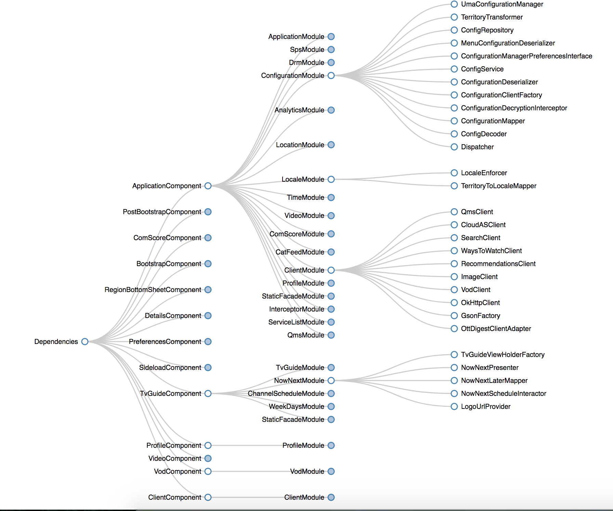

<p align="center"><a href="https://github.com/dvdciri/daggraph" target="_blank"></a></p>
<h1 align="center">Daggraph</h1>
<p align="center"><a href="http://square.github.io/dagger/" target="_blank">Dagger</a> dependency graph generator for Android Developers</p>
<p align="center">
  <a href="https://www.npmjs.com/package/daggraph"></a>
  <a href="https://www.npmjs.com/package/daggraph"></a>
  <a href="LICENSE"></a>
</p>

## Usage
Analyze the current folder:
> daggraph

or

Analyze a specific folder:
> daggraph `<folder_path>`

--------

Select which chart you want to generate:

<p align="center">
  
  
  
</p>

## Install

```sh
npm install -g daggraph
```

## Created by
[Davide Cirillo](https://github.com/dvdciri)

## License
MIT © [Davide Cirillo](https://github.com/dvdciri)
